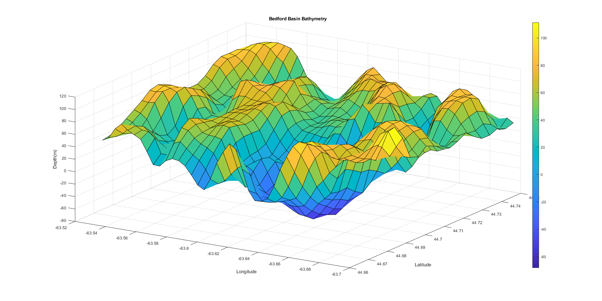
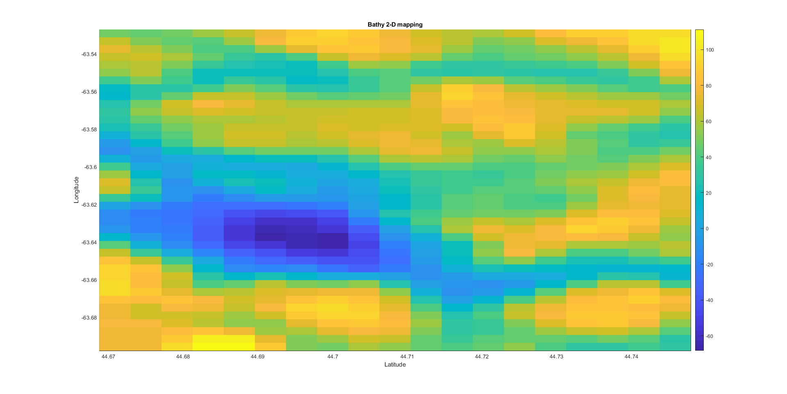
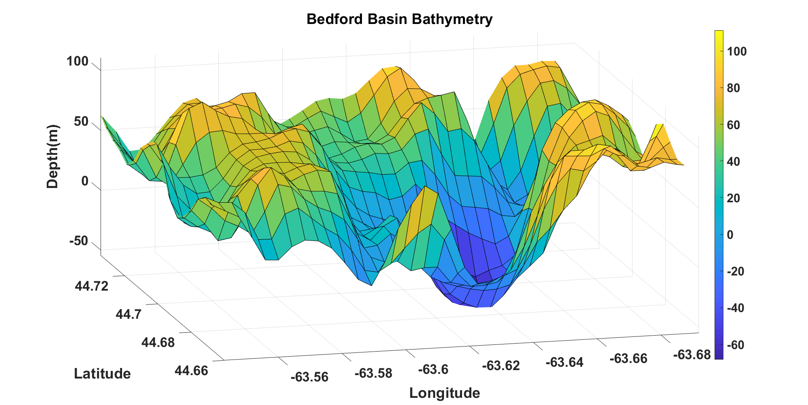

# Bedford 3D-bathymetry

## Author : Jay Patel 


`Bedford Basin Bathy from GEBCO 2019 database, required GEBCO 2019 - bedford basin bathy you can go to this link and download required custom bathy : https://download.gebco.net/`

## Bedford Basin 3D Bathymetry


## Bedford Basin 2D Bathymetry


## Bedford Basin 3D Bathymetry


## Bathy Reference

```bash
netcdf gebco_2019_n44.74834442138672_s44.666290283203125_w-63.7013053894043_e-63.52518081665039 {
dimensions:
	lat = 20 ;
	lon = 42 ;
variables:
	double lat(lat) ;
		lat:standard_name = "latitude" ;
		lat:long_name = "latitude" ;
		lat:units = "degrees_north" ;
		lat:axis = "Y" ;
		lat:sdn_parameter_urn = "SDN:P01::ALATZZ01" ;
		lat:sdn_parameter_name = "Latitude north" ;
		lat:sdn_uom_urn = "SDN:P06::DEGN" ;
		lat:sdn_uom_name = "Degrees north" ;
	double lon(lon) ;
		lon:standard_name = "longitude" ;
		lon:long_name = "longitude" ;
		lon:units = "degrees_east" ;
		lon:axis = "X" ;
		lon:sdn_parameter_urn = "SDN:P01::ALONZZ01" ;
		lon:sdn_parameter_name = "Longitude east" ;
		lon:sdn_uom_urn = "SDN:P06::DEGE" ;
		lon:sdn_uom_name = "Degrees east" ;
	float elevation(lat, lon) ;
		elevation:standard_name = "height_above_reference_ellipsoid" ;
		elevation:long_name = "Elevation relative to sea level" ;
		elevation:units = "m" ;
		elevation:sdn_parameter_urn = "SDN:P01::ALATZZ01" ;
		elevation:sdn_parameter_name = "Sea floor height (above mean sea level) {bathymetric height}" ;
		elevation:sdn_uom_urn = "SDN:P06::ULAA" ;
		elevation:sdn_uom_name = "Metres" ;

// global attributes:
		:Conventions = "CF-1.6" ;
		:title = "The GEBCO_2019 Grid - a continuous terrain model for oceans and land at 15 arc-second intervals" ;
		:institution = "On behalf of the General Bathymetric Chart of the Oceans (GEBCO), the data are held at the British Oceanographic Data Centre (BODC)." ;
		:source = "The GEBCO_2019 Grid is the latest global bathymetric product released by the General Bathymetric Chart of the 
		Oceans (GEBCO) and has been developed through the Nippon Foundation-GEBCO Seabed 2030 Project. This is a collaborative 
		project between the Nippon Foundation of Japan and GEBCO. The Seabed 2030 Project aims to bring together all available 
		bathymetric data to produce the definitive map of the world ocean floor and make it available to all." ;
		:history = "Information on the development of the data set and the source data sets included in the grid can be found in 
		the data set documentation available from https://www.gebco.net" ;
		:references = "DOI: 10.5285/836f016a-33be-6ddc-e053-6c86abc0788e" ;
		:comment = "The data in the GEBCO_2019 Grid should not be used for navigation or any purpose relating to safety at 
		sea.";
		:node_offset = 1. ;
data:

 lat = 44.66875, 44.6729166666667, 44.6770833333333, 44.68125, 
    44.6854166666667, 44.6895833333333, 44.69375, 44.6979166666667, 
    44.7020833333333, 44.70625, 44.7104166666667, 44.7145833333333, 44.71875, 
    44.7229166666667, 44.7270833333333, 44.73125, 44.7354166666667, 
    44.7395833333333, 44.74375, 44.7479166666667 ;

 lon = -63.6979166666667, -63.69375, -63.6895833333333, -63.6854166666667, 
    -63.68125, -63.6770833333333, -63.6729166666667, -63.66875, 
    -63.6645833333333, -63.6604166666667, -63.65625, -63.6520833333333, 
    -63.6479166666667, -63.64375, -63.6395833333333, -63.6354166666667, 
    -63.63125, -63.6270833333333, -63.6229166666667, -63.61875, 
    -63.6145833333333, -63.6104166666667, -63.60625, -63.6020833333333, 
    -63.5979166666667, -63.59375, -63.5895833333333, -63.5854166666667, 
    -63.58125, -63.5770833333333, -63.5729166666667, -63.56875, 
    -63.5645833333333, -63.5604166666667, -63.55625, -63.5520833333333, 
    -63.5479166666667, -63.54375, -63.5395833333333, -63.5354166666667, 
    -63.53125, -63.5270833333333 ;

 elevation =
  76.94922, 74.85938, 76.23438, 78.85547, 75.03516, 76.90625, 86.00781, 
    95.00391, 97.14844, 93.01172, 92.89844, 84.06641, 65.44531, 43.22669, 
    14.00768, -7.310585, -12.95955, -13.95913, 0.6908076, 33.23932, 63.57896, 
    70.81772, 55.55724, 36.0253, 8.810258, -10.35785, -4.446059, 10.0708, 
    23.04709, 29.66029, 31.01433, 26.08546, 15.73386, 16.39136, 35.73511, 
    53.77488, 59.23047, 64.83203, 73.11328, 63.76562, 47.57812, 41.80078,
  77.08594, 75.48047, 75.56641, 77.71875, 67.76172, 68.01562, 81.90625, 
    87.73438, 82.49219, 83.01172, 83.51172, 64.29688, 35.11219, 9.875418, 
    -8.914713, -18.51368, -20.55396, -20.8799, -9.46715, 19.39836, 33.14246, 
    25.92561, 14.20366, 2.19029, -4.524801, -2.31021, 15.2678, 28.11865, 
    35.03125, 43.93359, 53.01172, 48.62695, 28.27148, 28.58008, 51.72852, 
    60.87109, 61.36719, 66.40625, 61.92969, 50.53125, 44.15625, 44.27734,
  94.50781, 88.71875, 80.80078, 70.97656, 68.03125, 77.79297, 84.18359, 
    72.5625, 64.98828, 67.46482, 55.14501, 34.60516, 6.273511, -14.14413, 
    -18.77241, -22.57505, -24.01156, -24.61967, -21.90044, -8.281146, 
    -8.284787, -10.23062, -1.720311, -1.339007, 3.006743, 18.71838, 35.64408, 
    42.90999, 47.41016, 54.76562, 65.51172, 68.44531, 46.26953, 28.26562, 
    35.52344, 40.66016, 51.70312, 59.79297, 49.58984, 45.08984, 48.62891, 
    50.85938,
  109.9141, 104.5117, 85.15625, 61.85938, 65.21875, 76.50781, 79.46094, 
    59.61328, 39.21873, 28.02752, 13.20953, 2.242018, -16.42687, -31.82121, 
    -34.81558, -35.41402, -33.42561, -30.59953, -26.93684, -21.53179, 
    -10.5277, 9.74492, 16.64109, 7.554595, 5.879006, 29.4121, 52.50586, 
    55.31641, 55.83594, 58.50391, 69.8125, 77.64453, 63.75391, 37.04297, 
    20.84375, 18.94141, 33.69141, 45.58594, 38.64453, 43.45312, 55.94922, 
    59.89453,
  111.293, 102.9844, 76.04688, 52.85156, 56.16016, 65.01562, 68.86328, 
    62.3125, 43.93822, 13.34072, -12.26435, -22.51773, -32.29555, -45.91395, 
    -55.94984, -54.70089, -49.9521, -42.06462, -27.09094, -14.40594, 
    4.501016, 24.1528, 17.98244, 6.734375, 13.29102, 43.14453, 66.00781, 
    68.02734, 64.96875, 59.875, 67.40625, 72.32422, 64, 50.82812, 34.96484, 
    21.21094, 26.39062, 34.24219, 39.30078, 57.08203, 64.97266, 68.69922,
  88.37891, 72.75781, 55.62109, 54.81641, 68.14453, 77.98438, 74.46094, 
    71.19922, 61.32537, 22.57576, -15.11738, -30.14878, -41.83516, -56.44529, 
    -66.08946, -63.99164, -57.80767, -46.73273, -28.23045, -5.457515, 
    15.95101, 21.30467, 11.72853, 5.597656, 18.99609, 47.375, 64.02734, 
    68.33984, 65.92188, 61.26953, 64.48047, 64.75, 55.46875, 42.88281, 
    29.89062, 20.20703, 21.75781, 29.48828, 55.17188, 78.21484, 76.60156, 
    77.90234,
  51.73047, 51.26172, 57.98047, 72.57031, 88.73828, 93.17188, 85.84375, 
    72.62891, 49.88124, 15.63238, -14.3213, -34.74972, -51.90779, -62.94427, 
    -65.16801, -62.63089, -58.45257, -45.73696, -25.84316, -5.439976, 
    6.856074, 7.644289, 5.558494, 4.179688, 20.61719, 47.61328, 60.00781, 
    63.44141, 65.26953, 65.80859, 65.23438, 60.25391, 47.59375, 29.40625, 
    18.32031, 18.79688, 19.94922, 38.55859, 74.44141, 90.63281, 88.07812, 
    88.875,
  47.6875, 57.5625, 73.23438, 84.39453, 93.46875, 95.75781, 89.83984, 
    75.96094, 48.45219, 6.809888, -25.99592, -41.95237, -56.87207, -68.33894, 
    -66.46593, -56.58268, -50.32004, -38.60558, -19.25203, -7.815783, 
    -5.995221, -0.8972558, 5.703025, 11.59766, 26.90625, 46.78906, 61.34375, 
    68.44922, 69.43359, 68.25, 66.08203, 59.28125, 43.09375, 26.29688, 
    21.32812, 25.79688, 37.35938, 64.30859, 85.55469, 90.09766, 92.40625, 
    92.27344,
  59.08984, 68.40625, 78.52734, 86.80078, 92.44531, 91.15234, 85.40625, 
    75.2217, 52.96392, 5.132569, -33.47231, -41.77931, -45.0368, -49.65316, 
    -45.64114, -35.16273, -22.11432, -8.134238, -2.559922, -0.2740537, 
    2.971732, 6.740877, 13.88673, 26.95703, 43.63281, 59.46875, 70.48047, 
    72.67188, 68.64062, 67.29297, 67.04688, 59.57031, 44.50781, 34.03125, 
    33.25781, 40.98047, 56.46484, 76.34766, 88.19531, 85.58594, 87.61719, 
    87.33594,
  53.45703, 64.94922, 77.34375, 80.45703, 79.99023, 73.74025, 67.56062, 
    52.4069, 25.2382, -2.403594, -22.72251, -28.52216, -23.69878, -18.11183, 
    -10.68396, -3.162642, 13.98262, 25.32939, 15.83399, 13.45599, 20.00558, 
    21.80494, 26.05859, 40.35547, 60.375, 74.07812, 77.46094, 75.19531, 
    70.53125, 68.26953, 67.12109, 60.51172, 48.74609, 43.27734, 41.86328, 
    42.26562, 54.18359, 70.29297, 80.07422, 79.44531, 76.90234, 79.09766,
  46.62891, 46.14062, 51.32031, 56.37891, 49.88477, 38.84377, 26.06467, 
    9.954909, -1.673647, -11.89799, -10.24862, -3.999856, -2.225338, 
    -0.7361636, 9.421118, 26.82462, 39.62721, 38.14212, 29.57617, 29.63477, 
    31.96484, 33.26172, 35.19922, 44.71875, 63.08203, 75.71875, 73.00391, 
    68.87891, 70.01172, 70.14844, 70.80078, 74.17578, 73.30078, 65.31641, 
    47.62891, 30.44531, 38.12891, 61.47656, 72.5, 71.57422, 68.55469, 70.55078,
  39.36328, 35.45703, 30.57812, 30.88281, 24.60352, 14.45933, -1.506613, 
    -11.97457, -8.128887, -4.807637, 8.080005, 18.02243, 19.09123, 20.02843, 
    38.42005, 60.22584, 56.66602, 44.25195, 41.52734, 42.47266, 38.08984, 
    35.63672, 36.75, 45.00391, 58.55469, 64.48828, 57.97656, 57.375, 
    68.48438, 77.99219, 80.21875, 85.88281, 93.60938, 89.08594, 59.19922, 
    29.19922, 30.46875, 45.53516, 57.62891, 60.83594, 61.69141, 65.19531,
  44.79297, 41.56641, 33, 33, 39.86133, 32.61183, 12.8612, -4.805872, 
    -10.65363, 3.28682, 22.32327, 42.58845, 53.73828, 52, 67.45312, 77.32812, 
    64.625, 49.47266, 44.61719, 45.64062, 43.30859, 38.22656, 35.35547, 
    39.6875, 49.05469, 52.42578, 57.66406, 72.86719, 81.96484, 85.14062, 
    82.53125, 81.03125, 85.21484, 79.99219, 56.31641, 31.41797, 30.625, 
    39.08203, 44.19141, 50.47266, 59.35547, 65.71875,
  52.58203, 46.58203, 44.21875, 52.32812, 64.85938, 63.0529, 38.80937, 
    10.34068, -4.688946, 2.604772, 20.93457, 54.1582, 79.64062, 77.39453, 
    75.69141, 71.51562, 60.61719, 46.93359, 40.62891, 40.77344, 42.51953, 
    43.64453, 40.33594, 39.19531, 45.75391, 54.79688, 70.31641, 88.55859, 
    88.37891, 82.30859, 79.59766, 76.01172, 72.90234, 62.28125, 43.55469, 
    28.50781, 34.69922, 46.34766, 47.34766, 54.30469, 67.03125, 73.4375,
  41.07422, 44.46484, 57.89062, 71.84766, 78.96094, 77.47656, 63.07032, 
    43.33586, 14.44497, 5.671644, 18.53518, 35.54297, 58.26562, 72.14844, 
    78.40234, 79.38281, 69.38281, 51.56641, 38.91016, 37.47656, 44.75, 
    51.32422, 48.80469, 46.05469, 52.46484, 58.1875, 61.88672, 67.37891, 
    71.32812, 73.62109, 74.09375, 74.22266, 68.1875, 57.34375, 39.01172, 
    24.87109, 36.74609, 49.38281, 54.88672, 69.46094, 82.75, 86.22266,
  32.30469, 43.14453, 63.74609, 84.27344, 86.25781, 83.76172, 80.60547, 
    69.76952, 40.49223, 15.168, 15.21484, 23.96484, 38.92969, 60.50391, 
    80.92969, 91.69141, 84.89453, 70.16016, 55.82031, 48.80469, 54.10156, 
    59.39844, 53.93359, 47.67578, 47.88672, 51.17188, 50.07031, 46.58984, 
    54.42969, 66.18359, 72.08984, 71.53906, 62.11328, 50.03516, 34.66406, 
    25.45703, 40.01953, 54.73828, 62.10938, 77.36719, 91.01953, 93.30859,
  31.94531, 48.73828, 67.22656, 86.67578, 86.72656, 84.46094, 85.30859, 
    76.27344, 61.40234, 27.85547, 10.48438, 23.73047, 38.92188, 59.42969, 
    79.39062, 88.48828, 89.25, 81.51172, 72.77734, 69.84375, 69.88672, 
    65.48828, 57.83594, 51.29297, 43.76953, 40.62891, 41.80469, 40.14062, 
    46.49609, 63.07812, 72.53516, 68.03906, 55.86719, 42.10938, 31.30859, 
    33.12891, 50.71875, 62.69531, 73.92188, 83.96094, 90.76172, 92.94141,
  37.17188, 41.94922, 60.58984, 79.57422, 84.8125, 82.93359, 90.86719, 
    85.20312, 61.30859, 26.62891, 12.10156, 32.24609, 47.96875, 56.02734, 
    64.70703, 75.80859, 83.45703, 80.93359, 76.66016, 79.41016, 82.6875, 
    77.00391, 67.91016, 58.55078, 49.82031, 39.32812, 32.09375, 31.37109, 
    37.61328, 57.39062, 68.30469, 67.27344, 57.05078, 37.05469, 35.77344, 
    51.96875, 66.62109, 77.05078, 90.79297, 95.86328, 94.96094, 93.28516,
  31.26562, 28.06641, 43.12109, 53.78516, 65.07812, 75.85156, 82.86719, 
    71.47656, 36.44922, 10.94531, 13.37109, 38.23047, 60.48828, 61.49219, 
    54.89062, 57.25, 64.10547, 70.40625, 72.94141, 73.28125, 73.92969, 
    81.03516, 80.52344, 69.64844, 60.26562, 48.03125, 34.12109, 26.30078, 
    29.40234, 40.87891, 53.0625, 59.00781, 48.83203, 40.12891, 59.13281, 
    77.59766, 84.74609, 95.82031, 101.3203, 101.293, 96.98828, 90.97656,
  35.20703, 41.42578, 37.59766, 28.94141, 40.82422, 53.34375, 51.4375, 
    42.46484, 18.91406, 9.710938, 24.375, 42.85547, 57.25781, 60.27344, 
    51.15625, 43.33984, 44.33984, 52.52344, 60.23828, 65.57812, 67.13672, 
    76.83594, 86.21875, 80.18359, 69.03125, 54.55859, 39.79688, 28.42578, 
    24.60547, 25, 32.71484, 35.10938, 41.83594, 63.52734, 83.45703, 94.57031, 
    97.38281, 99.85547, 99.05859, 97.67578, 93.63281, 90.33594 ;
}

```
